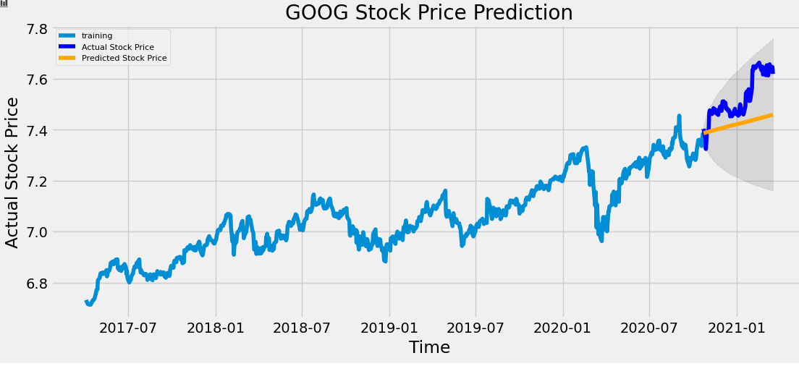

# :gem: :raised_hands: Ethically Sourced

### Team Members: Bryn Lloyd-Davies, Michael Garcia, Kelly Domico

## Objectives

- To build a robo advisor that recommends ethical companies to invest in. The bot will provide only companies that have been evaluated to meet at least one of the following categories: environmentally friendly, human rights support, unaffiliated with weapons or defense, cruelty free.

- To provide a 2-week forecast for a company based on its ticker symbol.

## Technologies Used

### Python Libraries
- [statsmodels](https://www.statsmodels.org/stable/index.html)
- [pmdarima: ARIMA estimators for Python](https://alkaline-ml.com/pmdarima/)
- [FastAPI](https://fastapi.tiangolo.com/)

## Obtaining Data and Data Cleaning

We downloaded data from the sites listed below. We then cleaned the data, enriched each company with its corresponding ticker, grouped the companies into the 4 categories and exported each group to a CSV file.

### Fortune Change the World List

Fortune recognizes companies that have had a positive social impact through activities that are part of their core business strategy.

### Corporate Knights Global 100 List

Corporate Knights produces rankings and financial product ratings based on corporate sustainability performance.

### Wikipedia: Socially responsible investing

The list from Wikipedia was obtained from the Global Impact Investing Network Trends Reports.

### Links
- Fortune. Change the World. https://fortune.com/change-the-world.
- Corporate Knights. Global 100 Reports. https://www.corporateknights.com/reports/global-100. 
- Impact Investing Trends. https://thegiin.org/assets/GIIN_Impact%20InvestingTrends%20Report.pdf

### Notebooks

- [Data Prep: Global 100 and Fortune's Change the World](notebooks/company_data_cleanup.ipynb)
- [Data Prep: SRI Funds](notebooks/sri_funds_data.ipynb)
- [Data Prep: Combining Datasets](notebooks/combine_company_databases.ipynb)

## Forecasting Model

We used the ARIMA model with log transformed stationary data. The ARIMA model is commonly used in forecasting time series. The data was split as a 90/10 train/test to make up for computational speeds when pulling larger datasets. In this case we pulled 1000 instances of data, but in production this should pull tens of thousands of instances based on the stock. 
We used a new library which iterates through different model orders to find the best fit. This was coded to run per each stock input by the bot, so each stock has a different order if needed. 

The model would then output the Mean Absolute Error Percentage for accuracy results, and the whether the forecast of positive or negative.

### Notebooks

- [Forecasting Model](notebooks/data_model.ipynb)

## Forecasting API

The forecasting model API is deployed to Azure as a web application. This API is accessed by the bot when it needs to return a forecast for a stock ticker.

To try out the API on your local machine, follow these steps:

1. Install FastAPI: `pip install fastapi`
2. Install uvicorn: `pip install uvicorn[standard]`
3. Change into the `api` directory: `cd api`.
4. Run the API: `uvicorn main:app`.
5. To get a forecast for GME (Gamestop), send a request to the following endpoint: `http://localhost:8000/forecasts/GME`.

## Ethos the Bot

- Ethos lets the user select one of four values that they feel is most important to them
 
- Ethos then provides the user a list of companies that align with that value
- The user then can input the ticker of any of the companies and recieve the two week projection for the stock

## Postmortem

- Track predictions to improve the confidence and accuracy of forecast model
- Cache results to speed up response time to bot
- Expand the company list so we can provide more options
- Generate our own ranking/scoring methodology based on news articles (NLP, sentiment analysis), financial statements, company products, etc...
- Deploy as an Alexa skill
 
## Additional Links

- [Bot Demo Video](bot/bot_recording.mov)
- [Presentation Slides](project-slides.pdf)
